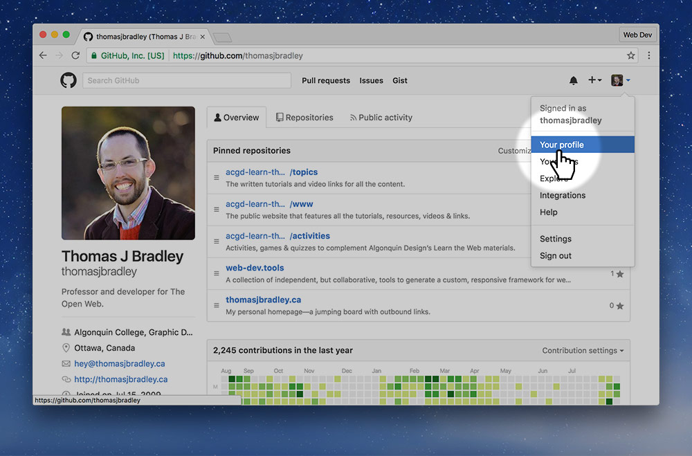

# Submit your GitHub account

- Approx. completion time: **3 minutes**
- Deliverables: **URL on Canvas**

---

**Submit your GitHub profile URL to this assignment so I have a record of it—and for marks.**

- Make your GitHub account (which should already be done).
- Go to your GitHub profile URL, by clicking `Top right icon > Profile`
- Copy the URL from your browser’s URL bar.
- Go to the [**GitHub account Canvas assignment**]().
- Submit your URL to the assignment.

---

## Example profile page



*This is approximately what your profile page should look like—and how to get there.*

---

## Hand in

*Make sure you can see your username in the URL.*

**It should look like this:**

```
https://github.com/thomasjbradley
```
